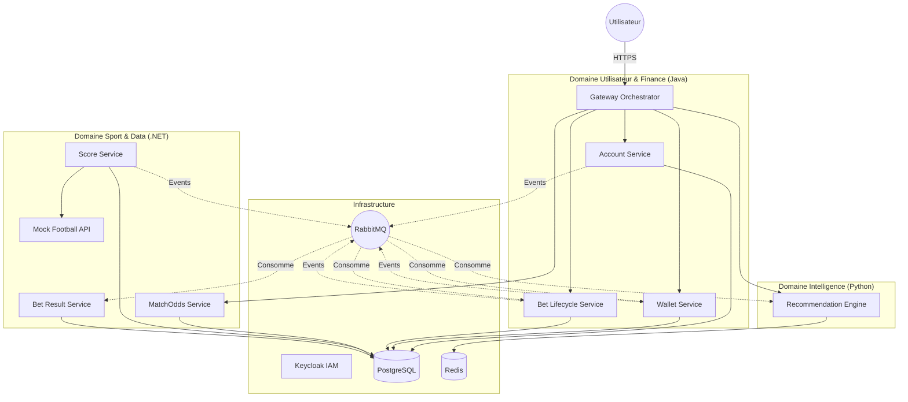

# 🏆 TRD Services - Plateforme de Paris Sportifs Microservices

Architecture microservices polyglotte et complète pour un système de paris sportifs, intégrant **Java Spring Boot**, **.NET 8**, **Python FastAPI**, **Docker**, **Kubernetes**, **PostgreSQL**, **RabbitMQ** et **Keycloak**.

---

## 👥 Équipe de Développement

- 👨‍💻 **BEKKOUCHE Mohamed Baha Eddine**
- 👨‍💻 **SEGHIR Abderrazak**

---

## 📑 Table des Matières

- [Vue d'ensemble](#-vue-densemble)
- [Architecture Globale](#-architecture-globale)
- [Catalogue des Services](#-catalogue-des-services)
- [Démarrage Rapide](#-démarrage-rapide)
- [Fonctionnalités Clés](#-fonctionnalités-clés)
- [Stack Technologique](#-stack-technologique)
- [URLs et Ports](#-urls-et-ports)
- [Bases de Données](#-bases-de-données)
- [Structure des Événements (RabbitMQ)](#-structure-des-événements-rabbitmq)

---

## 🔭 Vue d'ensemble

TRD est une plateforme distribuée conçue pour la **haute disponibilité** et la **scalabilité**.  
Elle sépare les domaines métiers en services autonomes communiquant via des **APIs REST** (synchrones) et un **Bus d'Événements** (asynchrones).

### Points forts

- ✅ Architecture **Hexagonale** pour le cœur métier (Java)
- ✅ Pattern **CQRS** pour la séparation Lecture/Écriture
- ✅ **SAGA Pattern** pour les transactions distribuées (Paris ↔ Wallet)
- ✅ Orchestration via **Gateway BFF** pour l'authentification
- ✅ **IA / ML** pour les recommandations personnalisées
- ✅ Infrastructure complète conteneurisée (IAM, DBs, Broker, Cache)

---

## 🏗 Architecture Globale

Le système est composé de **9 microservices principaux** et **4 composants d'infrastructure**.



## 📦 Catalogue des Services

### 🟢 Domaine Core (Java Spring Boot)

| Service               | Port  | Rôle |
|----------------------|-------|------|
| Gateway Orchestrator | :8088 | BFF. Point d'entrée unique. Orchestration de l'inscription (Keycloak + Account) et routage |
| Account Service      | :8081 | Gestion des profils utilisateurs et historique des paris |
| Bet Lifecycle Service| :8082 | Prise de pari, validation des règles et coordination SAGA |
| Wallet Service       | :8083 | Gestion des soldes, dépôts, retraits et verrouillage des fonds |

---

### 🔵 Domaine Data & Sport (.NET 8)

| Service            | Port  | Rôle |
|-------------------|-------|------|
| MatchOdds Service | :8085 | Catalogue des matchs, équipes et cotes |
| Score Service     | :8086 | Worker : synchronisation des scores et fins de match |
| Bet Result Service| :8087 | Worker : calcul des résultats et paiements |
| Mock Football API | :5000 | Simulation d'API externe pour tests |

---

### 🟡 Domaine Intelligence (Python)

| Service                | Port  | Rôle |
|------------------------|-------|------|
| Recommendation Engine | :8084 | Moteur hybride (Contenu + Collaboratif) |

---

## 🚀 Démarrage Rapide

### Prérequis

- Docker Desktop (Compose V2)
- Git

### Installation et Lancement

#### 1. Cloner le repository

```bash
git clone https://github.com/votre-repo/TRD-Platform.git
cd TRD-Platform
